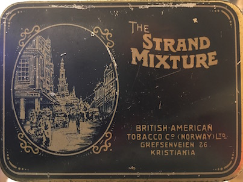

# snpflip

snpflip finds reverse and ambiguous strand SNPs.

## Changelog

```
# 0.0.6 (01.12.2017)
- Fix duplicate SNPs in output
# 0.0.5 (03.01.2016)
- Add helpful error message if there are no overlapping chromosomes in the
  bim file and fasta file.
# 0.0.4 (10.12.2015)
- Fix error that occured when using a large bim-file.
- Update help-message to include info on allowed chromosome names in fasta
  files.
# 0.0.3 (14.10.2015)
- Fix bug that threw error when the bim file contained
  positions that were N in the fasta file.
# 0.0.2 (14.10.2015)
- Fix bug that aborted execution when the fasta file contained
  chromosomes not in the bim file.
- Add version info (snpflip -v).
```

## Main use cases

- **Generate a list of SNPs not on the reference strand:** Many bioinformatics applications require the SNPs to be on the reference strand. By running snpflip on your GWAS data you'll find the SNPs that need to be flipped.

- **Quality controlling your GWAS data and pruning it:** If your GWAS data contains ambiguous SNPs, these might ruin the usefulness of your data for certain purposes (e.g., imputation). By running snpflip you can get the names of the ambiguous SNPs and remove them with Plink.

## Install
`pip install snpflip`

## Usage

```
snpflip

Report reverse and ambiguous strand SNPs.
(Visit github.com/endrebak/snpflip for examples and help.)

Usage:
    snpflip --fasta-genome=FA --bim-file=BIM [--output-prefix=PRE]
    snpflip --help
    snpflip --version

Arguments:
    -f FA --fasta-genome=FA     fasta genome
    -b BIM --bim-file=BIM       plink bim file (extended variant information)

Options:
    -h --help                   show this message
    -v --version                show the version number
    -o PRE --output-prefix=PRE  the prefix of the output-files
                                (./snpflip_output/<bim_basename> by default)

Note:
    To enable snpflip to match the chromosomes in the `.bim` and `.fa` files, the
    chromosomes in the `.bim` file must be called `1, 2, ... X, Y, M`
    while the chromosomes in the fasta file must be called the same, or
    `chr1, chr2, ... chrX, chrY, chrM`

    If there is whitespace after the chromosome name in the fasta file,
    additional text is allowed, e.g. the below fasta id is accepted:
    >1 dna:chromosome chromosome:GRCh37:1:1:249250621:1
```

## Output

The output files are:
- `<prefix>.reverse` - The SNPs that are on the reverse strand.
- `<prefix>.ambiguous` - The SNPs that cannot be assigned to a strand.
- `<prefix>.annotated_bim` - Strand annotated bim table.

The `.reverse` and `.ambiguous` output files can be used as input to Plink. This is convenient if you want to remove the ambiguous strand SNPs or flip the SNPs that are on the reverse strand.

#### Example usage with plink:

```snipflip -b snp_data.bim -f genome.fa -o snpflip_output```

```plink --file snp_data --flip snpflip_output.reverse --make-bed```

## Extended example

The files used below are found in the `examples` directory.

```
$ cat examples/example.fa
>chr1 dummy text
ACT
>chr2
CCC
>chrX
NNN
>chrY
ACT
> chr27
ACT

$ cat examples/example.bim
1 snp1 0 1 A C
1 snp2 0 2 A T
1 snp3 0 3 A G
2 snp4 0 1 A G
2 esv5 0 2 AA G
X inv1 0 2 A G
Y snp6 0 1 A G
25 snp7 0 2 A G

$ snpflip -b examples/example.bim -f \
 examples/example.fa -o extended_example
 # Chromosome 25 in .bim, but not in fasta file.
 # There were 1 'N' nucleotides in chromosome X

$ head extended_example.annotated_bim
chromosome	0_idx_position	snp_name	genetic_distance	allele_1	allele_2	reference	reference_re	strand
1	0	snp1	0	A	C	A	T	forward
1	1	snp2	0	A	T	C	G	ambiguous
1	2	snp3	0	A	G	T	A	reverse
2	0	snp4	0	A	G	C	G	reverse
2	1	esv5	0	AA	G	C	G	reverse
25	1	snp7	0	A	G			ambiguous
X	1	inv1	0	A	G	N	N	ambiguous
Y	0	snp6	0	A	G	A	T	forward

$ head extended_example.ambiguous
snp2
snp7
inv1

$ head extended_example.reverse
snp3
snp4
esv5
```

## Dependencies

`pandas`, `docopt` and `pyfaidx`. These are automatically installed when using pip.

## FAQ

#### My SNP-data is not in Plink .bed+.bim+.fam format. What do I do?

Use [Plink](https://www.cog-genomics.org/plink2/data) to convert your files to the binary plink format. Example:

`plink --vcf yourfile.vcf --make-bed --out your_prefix`

#### How do you decide the SNP type and what strand it came from?

Since the reference genome is based on the forward strand, finding an 'A' in the reference genome and the bim-file for said SNP tells you that it is from the forward strand. If the SNP were a 'T' it would have been a reverse strand SNP.

#### Where can I find fasta indexes?

The 1000 genomes ftp has a [hg19 fasta](http://ftp-trace.ncbi.nih.gov/1000genomes/ftp/technical/reference/human_g1k_v37.fasta.gz).

For other species/builds/versions, your best bet is this NCBI ftp: ftp://ftp.ncbi.nlm.nih.gov/genomes/archive/old_genbank/Eukaryotes/vertebrates_mammals/ or to search for `goldenpath <genome_name>`, i.e.
[duckduckgo](https://duckduckgo.com/?q=goldenpath+mm10). You will often
find zips of chromosome files that you need to unzip and then concatenate to produce a full genome fasta.

## Issues

See https://github.com/endrebak/snpflip/issues

Please ask support questions by raising an issue.


